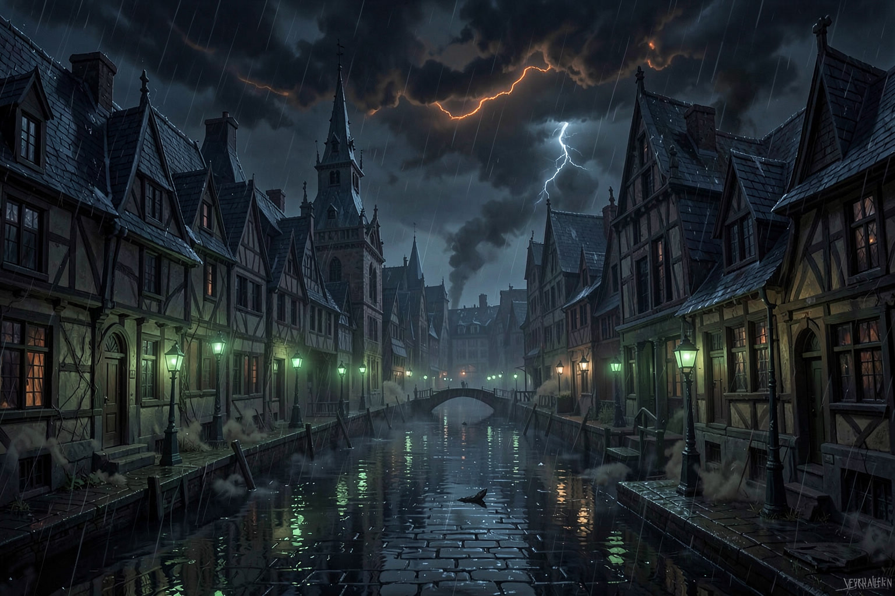

# The Ashen Grin

| Field | Value |
|---|---|
| **Tier** | 3 |
| **Party Level** | Five independent 10th-level characters |
| **Duration** | 3–4 hours; run Scenes 1.2 and 2.2 as pressure scenes if targeting 2.5–3 hours |
| **Setting** | Veyrhaven, original gothic canal city *(DM ADDITION)* |
| **Hook From** | Standalone; no prior session assumed |

---

## Adventure Summary

Three people have died in Veyrhaven with locked doors, ash on their lips, and death certificates altered before anyone outside city government can read them. **Mara Vey**, an undertaker, hires the party after discovering that all three victims once signed orders authorizing repairs beneath Glassward. The trail reveals a civic pact: archivist **Elian Voss** helped conceal an old ward-engine that contained **Vorthax, the Ashen Grin**, an ash-and-reflection entity fed by official denial. The Hall of Measures wants quiet; Vorthax wants one final public denial to make its containment permanent.

The party can follow evidence, protect witnesses, expose the Hall, force Voss to confess, or use his ward key to shut down the Seventh Ward. Combat is optional in the first two acts and inevitable only when Vorthax refuses a genuine resolution. The session’s horror comes from coercion, erased names, and civic convenience—not graphic violence.

## Running This Session

- **Tone:** Rain-black urban horror; professional officials making inhuman choices; no gore required.
- **Standalone continuity:** Veyrhaven is fully separate from Talthryn, Caer Aldreth, Bellwether, and all prior unplayed material.
- **Information:** Never gate progress behind one roll. A failed check costs time, raises an alarm, or makes a later conversation harder; it never deletes the lead.
- **Level scaling:** Written for five Level 10 PCs. 2014 DMG thresholds: Easy 3,000 / Medium 6,000 / Hard 9,500 / Deadly 14,000 adjusted XP.
- **Safety dial:** Replace murdered victims with comatose survivors and “ash at the mouth” with “gray dust in their breath” without changing the mystery.

# Act I — The City Refuses to Remember

## Act I, Scene 1.1 — The Undertaker’s Ledger

**Purpose / transition:** Establish the pattern, give the party a trusted contact, and point them toward the Glassward Baths and Elian Voss.

### Setting

- **Location:** Vey House of Rest, an old canal-side mortuary during a hard evening storm.
- **See:** Three covered biers; black wax on amended certificates; a lamp reflected twice in rainwater on the floor.
- **Hear:** Rain in the gutters, a distant ninth bell, and clerks outside arguing about which office owns the bodies.
- **Smell:** Wet wool, bitter herbs, lamp oil, and a dry mineral scent on the certificates.
- **Sense:** DC 13 Medicine identifies no ordinary inhaled poison. *Detect Magic* finds faint abjuration on the black wax; a DC 14 Arcana or Religion check identifies a containment mark, not a murder spell.

### NPCs

#### Mara Vey

- **Disposition going in:** Guarded, exhausted, and immediately respectful toward anyone who examines the dead rather than treating them as clues alone.
- **Motivations:** Preserve the victims’ names, stop a fourth death, and keep the Hall of Measures from taking her records.
- **Possible outcomes and effects:**
  - **If the party promises protection or shares a practical plan:** She gives them original certificates, names Voss as the archivist who requested amendments, and pays a 50 gp advance from her retainer.
  - **If the party dismisses the cover-up:** She still provides the bathhouse address but withholds her private copy of the repair order until shown real evidence.
  - **If asked who is in immediate danger:** She identifies Captain Dane as the only Watch officer refusing to sign the revised paperwork.

**Encounter:** None.

**Conditional follow-through:**
- **If the party takes the original certificates or wins Mara’s trust:** Voss recognizes them as informed in Act II, Scene 2.1; he begins Frightened but reachable.
- **Otherwise:** The Hall’s clerk arrives at the baths first and the archive has been partly cleared.
- **Transition:** A repair-order notation, soot-like salt on the paper, and Mara’s directions all lead to the Glassward Baths.

## Act I, Scene 1.2 — Mirrors in the Rain

**Purpose / transition:** Let the party examine the first breach point, meet Dane, and recover the archive cipher or provoke an optional fight.

### Setting

- **Location:** Glassward Baths, a shuttered public bathhouse beneath a cracked glass roof.
- **See:** A drained central pool, four standing mirrors with blackened backs, rain dripping through the ceiling, and uniformed warders posted around a sealed drain.
- **Hear:** Water falling into empty tiles, metal keys, and reflections whispering a half-second after real speech.
- **Smell:** Wet limestone, stale soap, ozone, and a thin trace of ash.
- **Sense:** DC 14 Investigation finds a municipal seal was opened from inside. A creature with truesight sees an ash thread running from every mirror to the drain. A DC 15 Insight check notices the warders are afraid, not malicious.

### NPCs

#### Captain Halric Dane

- **Disposition going in:** Controlled and skeptical. He has been ordered to restrict access, not explain the order.
- **Motivations:** Keep civilians out, keep his officers alive, and learn whether the Hall’s story is a lie before he openly defies it.
- **Possible outcomes and effects:**
  - **If shown Mara’s originals:** He allows a ten-minute inspection and quietly gives the party his watch sigil; it grants access through one civic cordon.
  - **If challenged publicly:** He holds the line, but tells the party the next lead is “the archive that forgot its own repairs.”
  - **If convinced the ward is actively lethal:** He evacuates the block, preventing civilian complications at the climax.

#### Ashbound Warders

- **Disposition going in:** Silent, compelled, and trying not to look into the mirrors.
- **Motivations:** Keep the drain sealed and prevent anyone from taking the hidden cipher.
- **Possible outcomes and effects:**
  - **If approached with Dane’s permission and a DC 15 Persuasion/Intimidation/Insight success:** They surrender the cipher and leave rather than fight.
  - **If the seal is broken, the mirror backs are smashed, or a warder is attacked:** They become hostile and trigger Encounter 1.

**Encounter:** **Encounter 1 — Mirrors in the Rain** (File 2), optional.

**Conditional follow-through:**
- **If the cipher is recovered peacefully:** Voss receives warning but has not destroyed the ward key in Act II, Scene 2.1.
- **If Encounter 1 occurs:** Dane backs the party publicly; the Hall labels them disruptive and Hollow Court defenders are alert.
- **Otherwise:** The cipher’s serial number maps to a restricted archive shelf and the route to the Hollow Court.

# Act II — The Record Beneath the Record

## Act II, Scene 2.1 — The Archive That Forgets

**Purpose / transition:** Expose Voss’s role, establish the ward-engine’s civic origin, and give the party a route and tool for the Seventh Ward.

### Setting

- **Location:** Veyrhaven Central Archive, a stone building with dry corridors above the flood line.
- **See:** Shelves of civic ledgers, a gap where an entire repair volume should be, paper dust shaped like erased handwriting, and Voss at a desk with a packed case.
- **Hear:** Pendulum clocks, distant thunder, turning pages, and a ventilation grate clicking open and shut.
- **Smell:** Ink, leather, dust, sealing wax, and ash that is absent everywhere except the missing shelf.
- **Sense:** DC 15 Investigation reconstructs a replacement order: three officials renewed a containment pact 18 years ago. *Speak with Dead* directed at a named victim confirms they were summoned to “sign again.”

### NPCs

#### Elian Voss

- **Disposition going in:** Terrified, defensive, and rehearsing an escape. If the party has Mara’s originals, he knows they can expose the lie.
- **Motivations:** Avoid being made the sole culprit, keep Vorthax from escaping, and preserve a small hope that the city can survive honest disclosure.
- **Possible outcomes and effects:**
  - **If offered protection, a chance to testify, or proof that Dane is not acting for the Hall:** He gives the ward key, explains the ash clock, and reveals that the Hollow Court’s verdict chamber opens the Seventh Ward.
  - **If threatened or publicly exposed without an exit:** He sends an alarm to the Hollow Court, then flees there with the key; the party can still follow his archive map.
  - **If asked why the pact exists:** He admits Vorthax was bound after a historic flood, but each renewal demanded a public official deny a preventable death.

**Encounter:** None.

**Conditional follow-through:**
- **If Voss cooperates:** The party has the ward key (advantage on conduit checks) and he appears as a shaky witness in Scene 2.2.
- **If Voss flees:** The Hollow Court begins with three Justiciars present and Voss can be rescued, captured, or lost during the encounter.
- **Transition:** The archive map identifies a sealed tribunal beneath the old Hall: the Hollow Court.

## Act II, Scene 2.2 — The Hollow Court

**Purpose / transition:** Put the city’s choice in physical form, obtain Voss’s testimony or the ward key, and open the descent to the Seventh Ward.

### Setting

- **Location:** A ruined underground tribunal where rainwater runs between broken benches.
- **See:** A raised judge’s dais, hollow statues with ash in their eye sockets, collapsed colonnades, and a brass floor hatch stamped with a civic seal.
- **Hear:** Dripping water, stone settling, and old verdicts repeated in voices that do not match the speakers.
- **Smell:** Cold stone, wet ash, oxidized brass, and a faint perfume from the former court galleries.
- **Sense:** DC 15 Religion or History recognizes the statues as oath-witnesses, designed to preserve legal testimony. A creature reading the dais sees a blank space where the ward renewal verdict was physically removed.

### NPCs

#### Elian Voss

- **Disposition going in:** Cooperative if protected; frantic if he fled; absent if he was killed or captured earlier.
- **Motivations:** Turn the blame toward the Hall without pretending he is innocent, and prevent Vorthax from obtaining a new public denial.
- **Possible outcomes and effects:**
  - **If given space to confess:** He speaks the full renewal formula; the brass hatch opens and one Justiciar stands down.
  - **If the party demands only punishment:** He still gives the route, but conceals the fact that closing all three vents is required to prevent the breach.
  - **If he is captured by the Justiciars:** His ward key lies at the dais; rescue him to gain the full truth.

#### Hollow Justiciars

- **Disposition going in:** Impersonal. They enforce the last recorded verdict, not current justice.
- **Motivations:** Preserve the sealed pact and prevent unrecorded testimony from altering it.
- **Possible outcomes and effects:**
  - **If the party presents Mara’s originals and Voss publicly confesses:** One Justiciar accepts the evidence; a DC 16 Persuasion, Religion, or legal argument check ends the scene without combat.
  - **If the party forces the hatch, attacks statues, or the Hall alarm was raised:** They trigger Encounter 2.

**Encounter:** **Encounter 2 — The Hollow Court** (File 2), optional.

**Conditional follow-through:**
- **If resolved by testimony:** Voss states the full vent rule; the party starts Act III with the ash clock at 0.
- **If Encounter 2 occurs:** Start Act III with ash clock 1; any surviving Justiciar collapses after giving the route.
- **Otherwise:** The floor hatch opens onto maintenance stairs descending to the Seventh Ward.

# Act III — The Ward Is Hungry

## Act III, Scene 3.1 — The Seventh Ward

**Purpose / transition:** Force a final decision: destroy or banish Vorthax, restore containment honestly, or accept its bargain.

### Setting

- **Location:** An octagonal ward-engine chamber under Veyrhaven’s oldest drains.
- **See:** A brass seal platform, four ash vents, flooded channels, conduits scratched with official signatures, and Vorthax waiting above the central seal.
- **Hear:** The city’s rain as a low roar through pipes, a slow bureaucratic recitation, and a heartbeat from inside the machinery.
- **Smell:** Hot metal, river water, incense, and dry ash.
- **Sense:** A DC 14 Arcana or Religion check identifies each vent as a separate containment failure. The ward key grants advantage on checks to close a vent. *Dispel Magic* cast at 5th level or higher closes one vent automatically.

### NPCs

#### Vorthax, the Ashen Grin

- **Disposition going in:** Calm, entertained, and certain that someone will choose quiet over truth.
- **Motivations:** Complete the renewed civic pact, acquire one public denial, and leave Veyrhaven dependent on it.
- **Possible outcomes and effects:**
  - **If the party accepts its bargain:** It resets the ash clock but names a witness who must deny the murders; Vorthax remains a future power.
  - **If three vents are closed:** It loses its regeneration and tries to escape through a reflection or negotiate surrender.
  - **If reduced to 0 HP while the clock is 0:** It is banished into the sealed engine; if the clock is 1+, it dissolves but leaves a recoverable ash shard.

**Encounter:** **Encounter 3 — Vorthax, the Ashen Grin** (File 2).

**Conditional follow-through:**
- **If clock reaches 4:** A breach spreads across Glassward; close the session as a containment success/failure and carry the district crisis forward.
- **If Vorthax is banished and records survive:** The Hall cannot plausibly deny the pact.
- **Otherwise:** The city can preserve public calm, but the party chooses who bears the unseen cost.

## Act III, Scene 3.2 — What the City Keeps

**Purpose / transition:** Resolve evidence, rewards, Voss and Dane’s futures, and what becomes public canon in Veyrhaven.

### Setting

- **Location:** The rain-swept steps of the Hall of Measures at dawn.
- **See:** Mara’s ledger in a waterproof case, exhausted Watch officers, officials behind shuttered windows, and ash washed into the gutters.
- **Hear:** Dawn bells, crowd murmurs, paperwork stamped inside the Hall, and distant water traffic returning.
- **Smell:** Rain, coffee, wet stone, and the first clean air after the ward is sealed.
- **Sense:** DC 12 Insight identifies whether Dane is prepared to confront the Hall; Mara’s posture makes clear whether she believes the party chose truth.

### NPCs

#### Mara Vey and Captain Halric Dane

- **Disposition going in:** Determined by the party’s treatment of victims, witnesses, and truth.
- **Motivations:** Mara wants names restored; Dane wants a defensible path that does not sacrifice more civilians.
- **Possible outcomes and effects:**
  - **If records are published:** Mara begins an inquiry and Dane protects witnesses; the Hall becomes an organized adversary.
  - **If records are sealed:** Dane can preserve order but Mara regards the party as having repeated the pact’s logic.
  - **If Vorthax’s bargain was accepted:** Both demand to know whose denial was purchased and whether it can be undone.

**Encounter:** None.

## Rewards and Resolution Checklist

| Reward | Condition | Value / effect |
|---|---|---|
| Mara’s retainer | Credible evidence returned | 250 gp total |
| Dane’s Watch reward | Civilians protected; breach contained | 500 gp |
| Ward key | Voss testifies or dies protecting it | Advantage on a future civic-ward investigation in Veyrhaven |
| Milestone | Resolve the Seventh Ward crisis | Earned; apply between sessions only |

- [ ] Victims’ names restored, preserved, or erased
- [ ] Voss: testified, fled, died, or was arrested
- [ ] Dane: retained command, resigned, or was removed
- [ ] Vorthax: banished, destroyed, bargained with, or escaped
- [ ] Evidence: published, sealed, or destroyed
