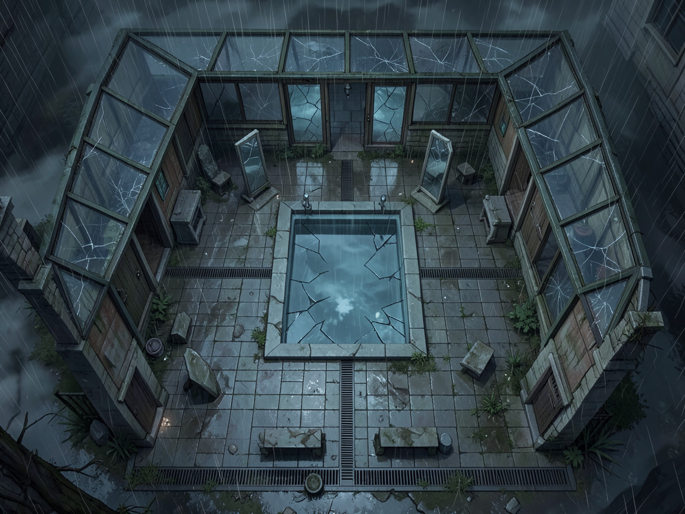
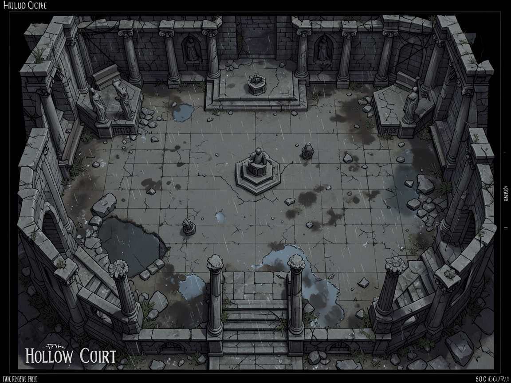
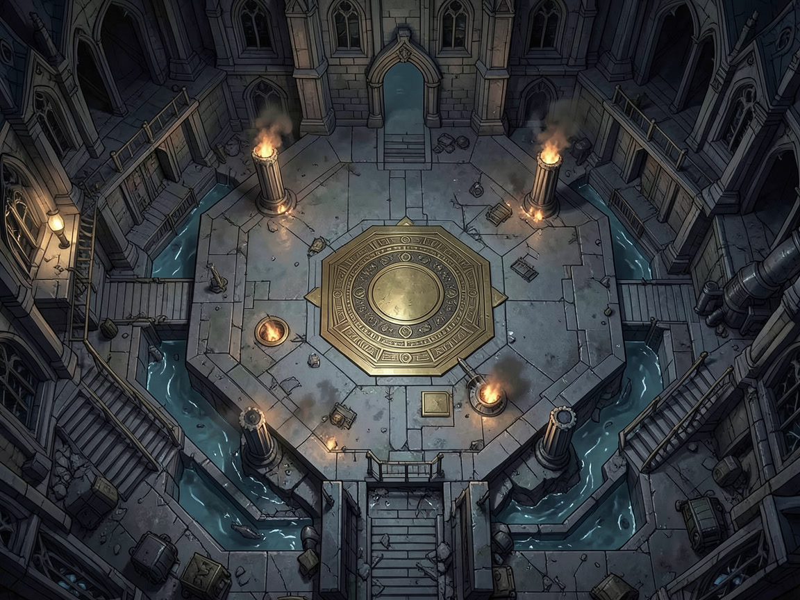

# The Ashen Grin — Combat Tracker

*Session 003 · DM combat tracker · All Veyrhaven creatures are homebrew ⚗️. Thresholds: 5× Level 10 PCs — Easy 3,000 · Medium 6,000 · Hard 9,500 · Deadly 14,000 adjusted XP.*

---

## Encounter 1 — Mirrors in the Rain

*Act I, Scene 1.2 · Medium (4,600 raw XP; 6,900 adjusted XP / Medium threshold 6,000)*

| Field | Value |
|---|---|
| **Location** | Glassward Baths |
| **Light** | Dim through storm glass; mirrors give intermittent bright flashes |
| **Terrain** | Slick tile, central pool, four mirrors, two covered galleries |
| **Cover** | Benches and mirror frames grant half cover |
| **Hazards** | A creature shoved into the pool loses 10 feet of movement climbing out; mirror shards are difficult terrain |
| **Objective** | Secure the archive cipher or inspect the drain seal |

**Round:** ☐ 1 · ☐ 2 · ☐ 3 · ☐ 4 · ☐ 5 · ☐ 6 · ☐ 7 · ☐ 8 · ☐ 9 · ☐ 10

| Init | Combatant | AC | HP | Notes |
|---|---|---|---|---|
| __ | _________________ | __ | _________________ | _________________ |
| __ | _________________ | __ | _________________ | _________________ |
| 14 | Ashbound Warders ⚗️ A–B | 16 | 85: ☐☐☐☐☐☐☐☐☐☐☐☐☐☐☐☐☐ | Protect seal; fear mirrors |
| __ | _________________ | __ | _________________ | _________________ |
| __ | _________________ | __ | _________________ | _________________ |
| __ | _________________ | __ | _________________ | _________________ |
| __ | _________________ | __ | _________________ | _________________ |

**Conditions:** Bln · Chr · Deaf · Frt · Grp · Inc · Inv · Prl · Pet · Pzn · Prn · Rst · Stn · Uns · Conc

### Triggers & Countdowns

- **Round 1:** Each warder attempts to move a PC away from the drain, not finish downed enemies.
- **Round 2:** A mirror flashes; the next warder attack deals an extra 7 (2d6) psychic damage if the target can see a mirror.
- **Morale:** If the cipher is displayed or either warder falls below 25 HP, both warders can make a DC 14 Wisdom save at the start of their turns; on a failure, they surrender and beg the party to close the ward.

### Tactics Summary

- **Ashbound Warder:** Holds a choke point, uses *Mirror Step* to avoid focus fire, then restrains a dangerous spellcaster with *Ashen Lash*.

### Loot / Aftermath

- The drain contains the archive cipher in a brass tube. Captured warders know only that “the archive remembers the route.”

### Ashbound Warder ⚗️

*Medium construct, lawful neutral · CR 6 (2,300 XP)*

**AC** 16 (reinforced civic plate) · **HP** 85 (10d8+40) · **Speed** 30 ft., swim 30 ft.

**STR** 16 (+3) · **DEX** 12 (+1) · **CON** 18 (+4) · **INT** 7 (−2) · **WIS** 12 (+1) · **CHA** 8 (−1)

**Saves** Con +7, Wis +4 · **Skills** Athletics +6, Perception +4 · **Damage Resistances** cold, lightning; bludgeoning, piercing, and slashing from nonmagical attacks · **Condition Immunities** charmed, exhaustion, frightened, poisoned · **Senses** darkvision 60 ft., passive Perception 14 · **Languages** understands Common but cannot speak

**Traits**
- **Bound to the Seal.** While within 30 feet of the drain seal, the warder has advantage on saving throws against spells and magical effects.
- **Mirror Step.** As a bonus action, the warder teleports up to 30 feet from one reflective surface it can see to another.

**Actions**
- **Multiattack.** Two Ashen Glaive attacks.
- **Ashen Glaive.** *Melee Weapon Attack:* +6 to hit, reach 10 ft., one target. *Hit:* 10 (2d6+3) slashing plus 7 (2d6) fire.
- **Ashen Lash (Recharge 5–6).** One creature within 30 feet must make a DC 15 Strength save. On a failure it takes 18 (4d8) force damage, is pulled up to 20 feet, and restrained by ash until the end of its next turn. On success, half damage and not restrained.

**Reactions**
- **Interpose.** When a creature the warder can see attacks the drain or a nearby warder, impose disadvantage on the attack roll.

**Round-by-round tactics:** Round 1 blocks the drain and tests melee attackers. Round 2 uses *Ashen Lash* on a controller or healer. Round 3+ keeps one warder adjacent to the seal and teleports the other behind cover. It yields if the cipher is secured and a PC gives a credible containment plan.

**On-defeat loot:** Brass civic plate worth 25 gp; cipher tube is the meaningful reward.

---

## Encounter 2 — The Hollow Court

*Act II, Scene 2.2 · Hard (5,400 raw XP; 10,800 adjusted XP / Hard threshold 9,500)*

| Field | Value |
|---|---|
| **Location** | Ruined tribunal beneath the old Hall |
| **Light** | Dim blue lanterns; bright light leaks from the floor hatch |
| **Terrain** | Dais north, broken benches, colonnades, two side chambers |
| **Cover** | Benches and pillars grant half cover |
| **Hazards** | A creature entering the dais hears a false verdict: DC 15 Wis save or speed 0 until end of next turn |
| **Objective** | Open the hatch and protect/recover Voss and the ward key |

**Round:** ☐ 1 · ☐ 2 · ☐ 3 · ☐ 4 · ☐ 5 · ☐ 6 · ☐ 7 · ☐ 8 · ☐ 9 · ☐ 10

| Init | Combatant | AC | HP | Notes |
|---|---|---|---|---|
| __ | _________________ | __ | _________________ | _________________ |
| __ | _________________ | __ | _________________ | _________________ |
| 13 | Hollow Justiciar ⚗️ A–C | 17 | 76: ☐☐☐☐☐☐☐☐☐☐☐☐☐☐☐☐ | Verdict marks / force movement |
| __ | _________________ | __ | _________________ | _________________ |
| __ | _________________ | __ | _________________ | _________________ |
| __ | _________________ | __ | _________________ | _________________ |
| __ | _________________ | __ | _________________ | _________________ |

**Conditions:** Bln · Chr · Deaf · Frt · Grp · Inc · Inv · Prl · Pet · Pzn · Prn · Rst · Stn · Uns · Conc

### Triggers & Countdowns

- **Round 1:** One Justiciar marks the creature nearest the hatch; others form a wall.
- **Round 2:** If no creature has read testimony aloud, the dais repeats a verdict and all Justiciars gain 10 temporary HP.
- **Testimony:** An action to present Mara’s originals and succeed on DC 16 Persuasion, Religion, or Intelligence (History) ends the fight for one Justiciar; a second success ends it for all.

### Tactics Summary

- **Hollow Justiciar:** Marks targets, forces them from the hatch, and uses *Sentence of Silence* against casters or negotiators.

### Loot / Aftermath

- The floor hatch opens with Voss’s testimony, the ward key, or successful force. The dais holds a brass plate naming the three original signers.

### Hollow Justiciar ⚗️

*Medium construct, lawful neutral · CR 5 (1,800 XP)*

**AC** 17 (stone shell) · **HP** 76 (9d8+36) · **Speed** 25 ft.

**STR** 18 (+4) · **DEX** 10 (+0) · **CON** 18 (+4) · **INT** 10 (+0) · **WIS** 14 (+2) · **CHA** 12 (+1)

**Saves** Str +7, Wis +5 · **Skills** Insight +5, Intimidation +4 · **Damage Resistances** necrotic, psychic; bludgeoning, piercing, slashing from nonmagical attacks · **Condition Immunities** charmed, exhaustion, frightened, poisoned · **Senses** darkvision 60 ft., passive Perception 15 · **Languages** Common, legal cant

**Traits**
- **Recorded Verdict.** The Justiciar has advantage on attacks against a creature it has marked.
- **Oath-Witness.** It cannot knowingly harm a creature that speaks a truthful confession while standing on the dais.

**Actions**
- **Multiattack.** Two Gavel Fist attacks.
- **Gavel Fist.** *Melee Weapon Attack:* +7 to hit, reach 5 ft., one target. *Hit:* 11 (2d6+4) bludgeoning plus 7 (2d6) force.
- **Mark for Contempt.** One creature within 60 feet must succeed on a DC 15 Wisdom save or be marked for 1 minute. A marked creature’s speed is reduced by 10 feet and it cannot take reactions. It repeats the save at the end of each turn.
- **Sentence of Silence (Recharge 5–6).** Up to two creatures within 30 feet must make DC 15 Charisma saves. On a failure, each takes 18 (4d8) psychic damage and cannot speak above a whisper until the end of its next turn; on success, half damage.

**Reactions**
- **Objection.** When a marked creature moves, reduce that movement by 15 feet.

**Round-by-round tactics:** Round 1 marks characters who can reach the hatch. Round 2 pairs *Sentence of Silence* with physical blocking. Round 3+ focuses on forcing intruders away, not killing them. A truthful public confession on the dais is the intended noncombat off-ramp.

**On-defeat loot:** Stone oath seal worth 50 gp to an historian; brass signer plate.

---

## Encounter 3 — Vorthax, the Ashen Grin

*Act III, Scene 3.1 · Near-Deadly (6,800 raw XP; 13,600 adjusted XP / Deadly threshold 14,000)*

| Field | Value |
|---|---|
| **Location** | Seventh Ward-engine chamber |
| **Light** | Dim; seal flashes bright when a vent closes |
| **Terrain** | Central platform, four vents, flooded channels, six pillars, north/south stairs |
| **Cover** | Pillars grant half cover; channels grant three-quarters cover while prone behind their walls |
| **Hazards** | Ash clock advances at initiative 20; vents can be closed with actions |
| **Objective** | Close three vents, contain Vorthax, and survive the pact’s collapse |

**Round:** ☐ 1 · ☐ 2 · ☐ 3 · ☐ 4 · ☐ 5 · ☐ 6 · ☐ 7 · ☐ 8 · ☐ 9 · ☐ 10

| Init | Combatant | AC | HP | Notes |
|---|---|---|---|---|
| __ | _________________ | __ | _________________ | _________________ |
| __ | _________________ | __ | _________________ | _________________ |
| 16 | Vorthax, the Ashen Grin ⚗️ | 18 | 175: ☐☐☐☐☐☐☐☐☐☐☐☐☐☐☐☐☐☐☐☐☐☐☐☐☐☐☐☐☐☐☐☐☐☐☐ | Legendary; ash clock |
| __ | _________________ | __ | _________________ | _________________ |
| __ | _________________ | __ | _________________ | _________________ |
| 12 | Ashen Attendants ⚗️ A–B | 14 | 45: ☐☐☐☐☐☐☐☐☐ | Repair vents / harry casters |
| __ | _________________ | __ | _________________ | _________________ |
| __ | _________________ | __ | _________________ | _________________ |

**Conditions:** Bln · Chr · Deaf · Frt · Grp · Inc · Inv · Prl · Pet · Pzn · Prn · Rst · Stn · Uns · Conc

### Triggers & Countdowns

- **Initiative 20:** Advance ash clock by 1 unless a vent was closed since the previous count. Clock effects appear in File 4.
- **Vents:** Action, DC 16 Arcana/Religion/Thieves’ Tools; ward key grants advantage. *Dispel magic* (5th+) automatically closes one. Three closed vents set clock to 0.
- **Attendants:** If an attendant begins adjacent to a closed vent, it can use its action to reopen it unless stopped.
- **Vorthax at 0 HP:** If clock 0, banished into the seal. If clock 1+, it dissolves into a shard and may return after the session.

### Tactics Summary

- **Vorthax:** Speaks first, targets isolated witnesses, uses legendary movement to threaten vents, and bargains when three vents close.
- **Ashen Attendants:** Reopen vents, impose disadvantage on conduit checks, then fade when Vorthax is banished.

### Loot / Aftermath

- Ward key; brass names of original signers; an ash shard if Vorthax was dispersed above clock 0. The shard is dangerous evidence, not ordinary treasure.

### Vorthax, the Ashen Grin ⚗️

*Large fiend, neutral evil · CR 10 (5,900 XP)*

**AC** 18 (obsidian mantle) · **HP** 175 (14d10+98) · **Speed** 30 ft., fly 40 ft. (hover)

**STR** 18 (+4) · **DEX** 16 (+3) · **CON** 24 (+7) · **INT** 17 (+3) · **WIS** 16 (+3) · **CHA** 20 (+5)

**Saves** Dex +7, Con +11, Wis +7, Cha +9 · **Skills** Deception +9, Insight +7, Perception +7 · **Damage Resistances** cold, fire, lightning; bludgeoning, piercing, slashing from nonmagical attacks · **Damage Immunities** poison · **Condition Immunities** charmed, poisoned · **Senses** darkvision 120 ft., truesight 60 ft., passive Perception 17 · **Languages** Common, Infernal, telepathy 120 ft.

**Traits**
- **Legendary Resistance (2/Day).** If Vorthax fails a saving throw, it can choose to succeed instead.
- **Ashen Regeneration.** Vorthax regains 15 HP at the start of its turn while the ash clock is 1 or higher and at least one vent remains open. It does not regenerate if three vents are closed.
- **Reflection Passage.** Vorthax can move through a reflective surface as if it were difficult terrain. At ash clock 2+, it can use this trait once per round to teleport up to 40 feet between reflective surfaces.

**Actions**
- **Multiattack.** Vorthax makes two Cinder Claw attacks or one Cinder Claw and one Withering Record attack.
- **Cinder Claw.** *Melee Weapon Attack:* +8 to hit, reach 10 ft., one target. *Hit:* 13 (2d8+4) slashing plus 10 (3d6) fire.
- **Withering Record.** *Ranged Spell Attack:* +9 to hit, range 120 ft., one target. *Hit:* 22 (4d8+4) psychic damage, and target must succeed on a DC 17 Wisdom save or have disadvantage on its next saving throw before the end of its next turn.
- **Demand Denial (Recharge 5–6).** Up to three creatures Vorthax can see within 60 feet make DC 17 Wisdom saves. Failure: 27 (6d8) psychic damage and charmed until end of next turn; while charmed this way, a creature cannot willingly use an action to close a vent. Success: half damage and not charmed.

**Legendary Actions (3/round)**
- **Drift (1 action).** Move up to half fly speed without provoking opportunity attacks.
- **Ashen Whisper (1 action).** One creature within 60 feet makes DC 17 Wisdom save or takes 7 (2d6) psychic damage and cannot take reactions until next turn.
- **Scour a Name (2 actions).** One creature within 30 feet makes DC 17 Charisma save or takes 14 (4d6) psychic damage and has disadvantage on its next ability check.

**Round-by-round tactics:** Round 1 offers a bargain, then uses *Demand Denial* if refused. Round 2 attacks a conduit worker and uses Drift to remain above flooded ground. Round 3+ prioritizes unopened vents and uses *Scour a Name* against characters attempting checks. If three vents close, it retreats into mirrors or offers surrender; it does not fight to destruction unless denied all exit and bargaining routes.

**On-defeat loot:** Ash shard (if not banished), original ward contracts, and the names of every official who renewed the pact.

### Ashen Attendant ⚗️

*Small elemental, neutral evil · CR 2 (450 XP)*

**AC** 14 · **HP** 45 (10d6+10) · **Speed** 30 ft., fly 30 ft. (hover)

**STR** 8 (−1) · **DEX** 16 (+3) · **CON** 12 (+1) · **INT** 6 (−2) · **WIS** 10 (+0) · **CHA** 8 (−1)

**Damage Resistances** fire, lightning; bludgeoning, piercing, slashing from nonmagical attacks · **Damage Immunities** poison · **Condition Immunities** grappled, poisoned, prone · **Senses** darkvision 60 ft., passive Perception 10 · **Languages** understands Infernal

**Traits**
- **Vent Tender.** The attendant has advantage on checks to reopen a vent.

**Actions**
- **Cinder Touch.** *Melee Spell Attack:* +5 to hit, reach 5 ft., one target. *Hit:* 10 (2d6+3) fire.
- **Choking Ash (Recharge 5–6).** Creatures in a 15-foot cone make DC 13 Constitution saves, taking 13 (3d8) poison damage on failure or half on success; failed save also prevents reactions until next turn.

**Round-by-round tactics:** Round 1 moves to separate vents. Round 2 reopens any closed vent. Round 3+ harasses casters and conduit workers; never stands in melee if it can fly away.

**On-defeat loot:** None; they collapse into harmless soot when Vorthax is banished.

---

