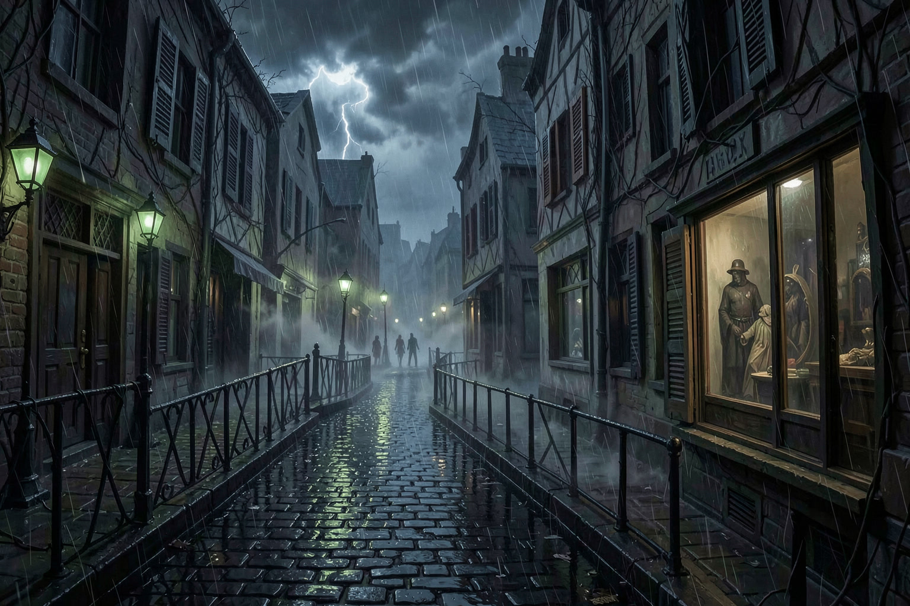
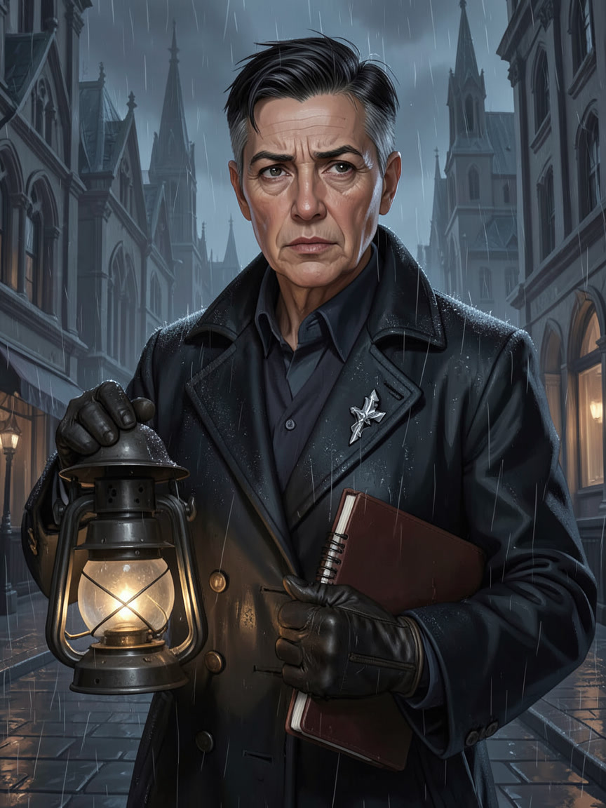
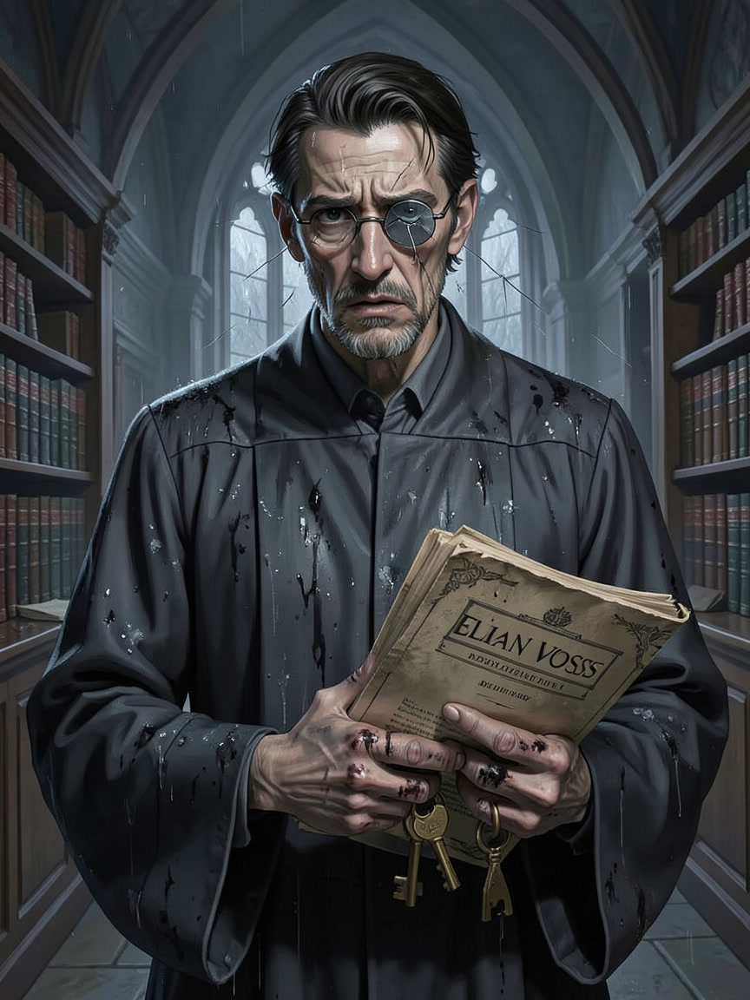
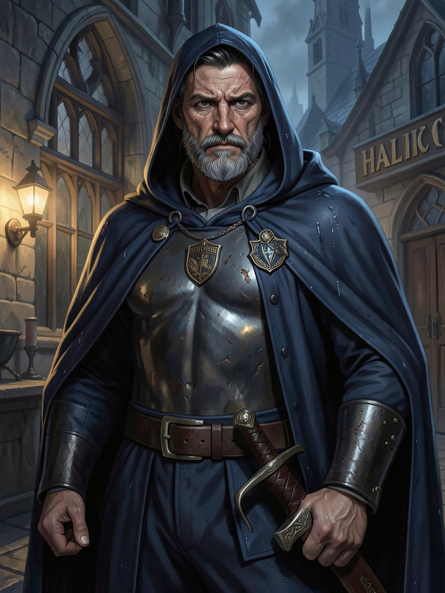
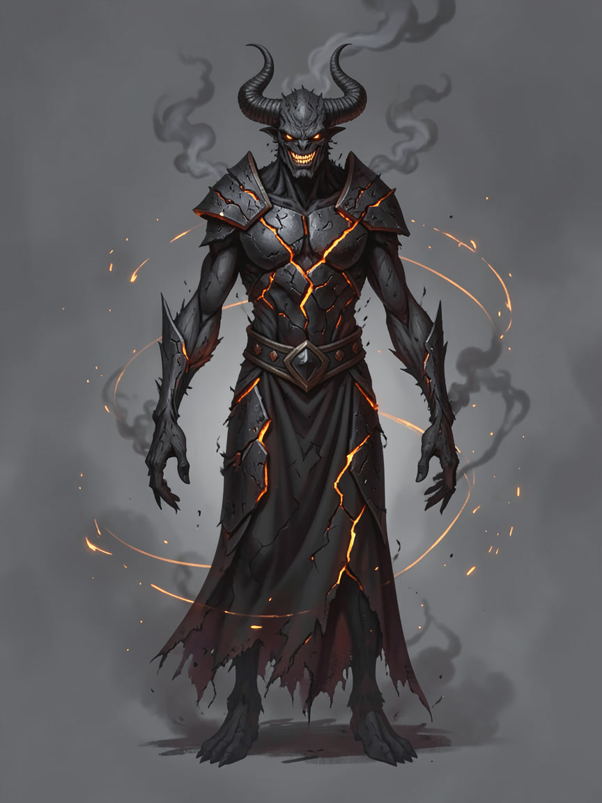

# Where We Left Off

This is a **standalone adventure**; no earlier events are assumed. You have arrived in **Veyrhaven**, a canal city under a hard storm. Three citizens have died in locked rooms, each with gray ash on their lips and a final expression no one can explain. The watch has closed the streets around the Glassward Baths, but bodies keep appearing whenever the bells stop.

**What now?**
- Speak with **Mara Vey**, the undertaker who refused to falsify the first death certificate.
- Examine the baths before the rain destroys the traces.
- Decide whether the city’s officials deserve your trust.

---

## Public Notice — Temporary Curfew

**VEYRHAVEN CIVIC WATCH**

By order of the Hall of Measures, Glassward residents are to remain indoors after the ninth bell. Do not handle gray ash, mirrors with blackened backing, or correspondence bearing an unbroken black-wax seal. Report any person heard laughing alone in an empty room.

*Signed, Captain Halric Dane.*

## Case Ledger — Facts Known to the Party

| Fact | What it means |
|---|---|
| Three deaths occurred in locked or watched rooms | The killer may not need a physical route |
| Each victim had fine gray ash at the mouth | The ash is evidence, not merely smoke residue |
| The Glassward Baths lie near the oldest storm drains | The district is the immediate investigation site |
| Mara Vey requested capable outsiders | Someone inside the city may be suppressing the case |

## Veyrhaven

A soot-dark canal city of rain, slate roofs, gas lamps, civic archives, and districts built over older foundations. *(DM ADDITION)*

## Mara Vey

An undertaker who keeps precise records, asks difficult questions, and will not let the dead be made convenient. *(DM ADDITION)*

## Elian Voss

A civic archivist with the keys to old records and a visible fear of what those records contain. *(DM ADDITION)*

## Captain Halric Dane

A practical watch captain trying to contain panic while deciding whether his superiors are protecting the city or themselves. *(DM ADDITION)*

## Vorthax, the Ashen Grin

A name whispered in connection with the deaths. Whether it is a murderer, a curse, or a story used to frighten witnesses is for the party to learn. *(DM ADDITION)*
